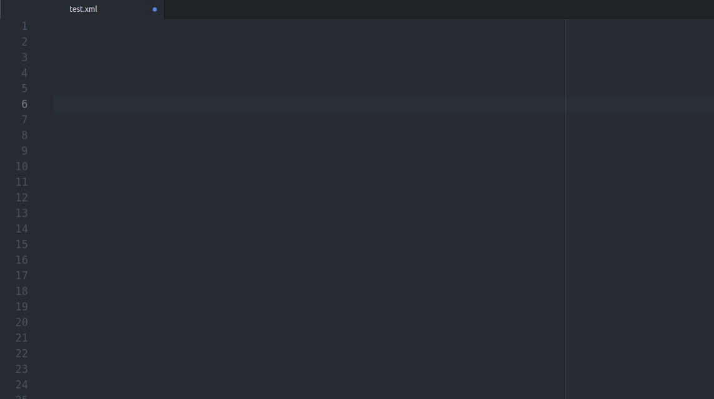

# pitasc-plugin package

Replace skill name with description

Press `Ctrl + o` to replace the skill name with its corresponding default skill

Skills should be rendered before with the `python pitasc_boiler_plate.py <additional repos>`.

This creates a file `pitasc.dump`, which is the base for the replace function.

- [ ] Add direct call to the python program (toogle or dynamically)
- [ ] Check every item for correctness (only superficial checks right now)
- [ ] add regex checks, to adapt for orthography
- [ ] hover-over would be nice :)
- [ ] skill lists are not added yet (e.g. `skill_sequence`)
- [ ] Proper release to Atom package list, as soon as it is not broken anymore
- [ ] check if having the same ID and prototype is allowed
